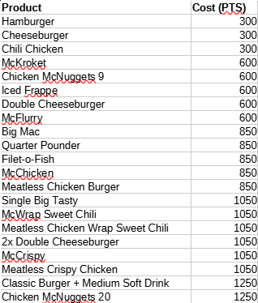
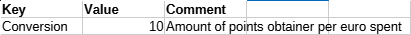
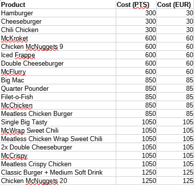
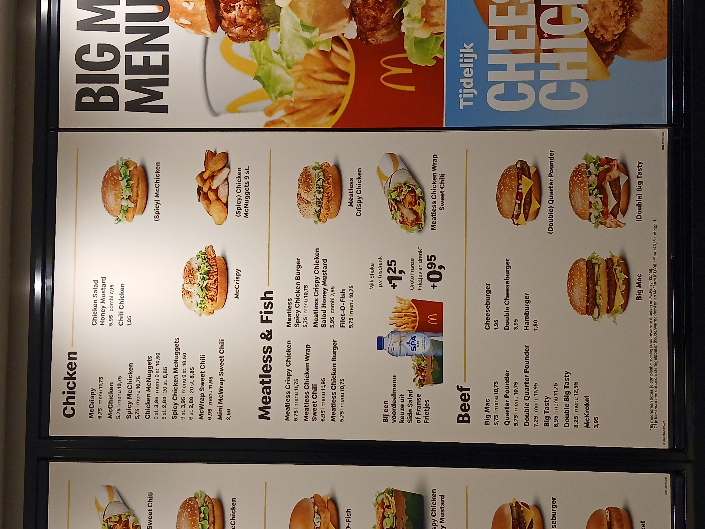
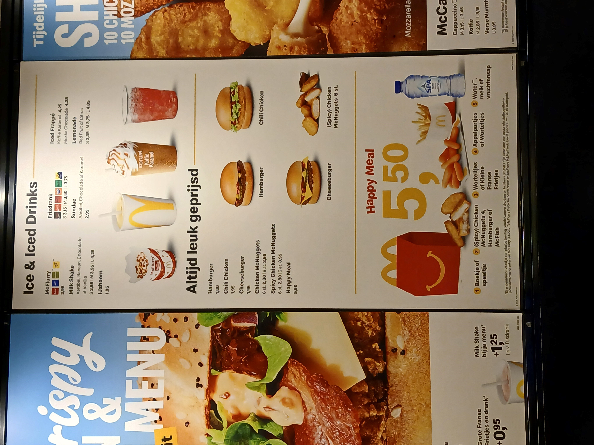
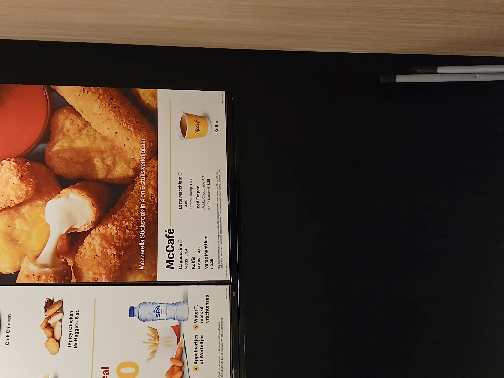
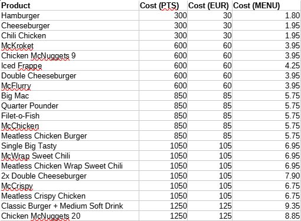

# McDonalds Rewards Points

I often visit McDonalds after my friday shift is done to get something quick to eat and due to a small trick, it generally costs me pennies at worst.  
Now it's not my favourite thing to eat but after a long night shift, it's definitely a welcome reward to break up what would otherwise be a boring "eat, sleep, work, repeat" cycle.  
And just like pretty much all fast food chains nowadays, McDonalds also has an app in which you can get loyalty points to then trade in for rewards.

Now, I've been accumulating enough points to basically get any item off the rewards list...  
Which begs the question, which item should I even pick?  
Some would just go with their favourite, others would pick whatever they feel like...  
But well, I kinda like most of it...  
So I decided to see what is the most efficient in terms of money spent vs what you get out.

## Gathering Data

Of course, first I had to gather my data.  
Some of it was easy to find, others... Slightly less easy.

First, I had to see what I could even get and how much it costed.  
Luckily, this is displayed in the app, which makes it very easy to find.  
To make it easier to work with, I created a little spreadsheet in [LibreOffice](https://www.libreoffice.org/) Calc and added each of the items + how much points they cost.

The app also tells me how much points I earn, which is 10 points per euro spent and it seems to be rounding _up_ (eg. `9.95` becomes `100` points).  
Which I entered on a different sheet.

Now I could easily calculate how much euro I had to spend in order to accumulate the required points.  
This is technically not really important to be displayed since my head is at least *somewhat* capable of doing mental arithmetic, but it might be nice in case it changes (eg. every euro gives only 9 points).

Next, I had to figure out how much each of the items cost.  
This was the tricky part because I could not find a decent price-list online.  
Some of it, I could find out by looking at past banking transactions (I sure do seem to love my nuggies) but the rest I couldn't.  
And sadly, some of my nightshifts last beyond the "closing time" of the restaurant, making it harder to just note everything down from the machine.  
The menu outside at the McDrive (albeit it was more of a McWalk since the truck doesn't fit through) also was very incomplete and rather inconvenient.  
But just as luck would have it, I got a shift that only lasted till 23:00, plenty of time to go inside and note everything down!..  
Which I then promptly forgot to do...

As a saving grace, they still had a "manual order" counter with a pricelist on the wall behind it!  
So I took some quick pictures of that instead.

So let's enter that into the spreadsheet too!

Some items, however, don't exist on the menu the same way they are displayed in the app.
For the `2x Double Cheeseburger` and the `Classic Burger + Medium Soft Drink` I just simply added the cost of each individual item together.
So the `2x Double Cheeseburger` became `2 * 3.95 == 7.90` and the `Classic Burger + Medium Soft Drink` became `5.75 + 3.60 == 9.35`.

Now I had to calculate how efficient each of the items were, which is very simple to do as well.
Simply divide the menu cost of the item with the cost it requires to accumulate the points (eg. the hamburger would become `1.80 / 30`).
This gave me the following table:

## Conclusions

When looking at the table, I made the following observations:

- Hamburgers give a *abysmal* efficiency at only `6.00%`, being significantly lower than the other 300pt items as well as the single lowest scoring item.
- Iced Frappe's heavily surprised me with a `7.08%` efficiency, being a significant outlier among the other 600pt items (which all give `6.58%` otherwise), as well as being among the highest scoring items in the entire list.
- The `2x Double Cheeseburger` heavily surprised me as well, reaching a `7.52%` efficiency being the single-most efficient item on the list.
- The `Chicken McNuggets 20` scored lower than I expected, giving only a `7.08%`, although this is mostly because I am biased towards my nuggies.
- More points spent does not equal more efficiency.
- Despite there being clear winners and losers, everything is horribly inefficient regardless of which you choose.

This puts the rankings as follows:

1. `2x Double Cheeseburger` (`7.52%`)
2. `Classic Burger + Medium Soft Drink` (`7.48%`)
3. `Chicken McNuggets 20` and `Iced Frappe` (`7.08%`)
4. `Big Mac`, `Quarter Pounder`, `Filet-o-Fish`, `McChicken` and `Meatless Chicken Burger` (`6.76%`)
5. `Single Big Tasty`, `McWrap Sweet Chili`, `Meatless Chicken Wrap Sweet Chili` (`6.62%`)
6. `McKroket`, `Chicken McNuggets 9`, `Double Cheeseburger` and `McFlurry` (`6.58%`)
7. `Cheeseburger` and `Chili Chicken` (`6.50%`)
8. `McCrispy` and `Meatless Crispy Chicken` (`6.43%`)
9. `Hamburger` (`6.00%`)

## Acknowledgements

This little research has only been conducted in my home country (`The Netherlands`) with prices of a _single_ restaurant on `29-01-2026`.
It might be that rewards and their costs change per country, that different restaurants within the same country have different prices and that you may earn more or less points per unit of currency.
However, the same logic and formulas can easily be applied to every country and place.  

Additionally, it doesn't take into account "food per point" (the sheer amount of food you get).  
As a result of this, despite a higher efficiency in terms of monetary value, actual "food value" may be lower.

If you wanna play around with it yourself, you can get the spreadsheet [here](mcdonalds-points.ods).
