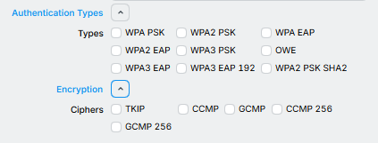
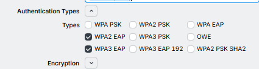

# WiFi Authentication Methods

Imagine this, you get your new MikroTik device, hook it up and open WinBox to change the WiFi settings.  
Then you stumble upon the "security" settings where you may see a few confusing things under "Authentication Types" and "Encryption".

You've heard of them but probably never really knew what to pick, or in some cases, selecting certain options may cause security problems or cause devices to simply no longer connect.  
In this post, I'll briefly tell you about what these settings mean, which ones you should pick and some extra considerations.  
Please note that most of this information isn't really specific to MikroTik, it applies to the likes of Cisco and UniFi all the same.  
I'm just too broke to afford using Cisco and have too much self-respect to use UniFi, so MikroTik it is.

## Authentication Types

Looking at our authentication types, we should see the following:
- `WPA PSK`
- `WPA EAP`
- `WPA2 PSK`
- `WPA2 EAP`
- `WPA2 PSK SHA2`
- `WPA3 PSK`
- `WPA3 EAP`
- `WPA3 EAP 192`
- `OWE`

For those old enough to have a Nintendo DS or something in the early-2000's, you may notice `WEP` missing.  
Which is a good thing in 2026, nobody should use `WEP` anymore and it's good that MikroTik doesn't let you shoot yourself in the foot like that.  
Because we all know, people will shoot themselves in the foot like that if presented the opportunity.  
Although some people maybe into that, we don't kinkshame here... Out loud that is.  

The different `WPA` generations are just that, their generations.  
`WPA` being the oldest of the lot, then `WPA2` and `WPA3` being the newest at the time of recording this.  
I won't talk about `WPA` much as it's old and broken just like `WEP`.  
`WPA` was meant as a stop-gap between `WEP` and `WPA2` due to hardware limitations.  
`WPA` allowed hardware incompatible with `WPA2` to get some extra security until it was binned and replaced with newer hardware that supported `WPA2`.

`PSK` and `EAP` stand for "Pre-Shared Key" and "Extensible Authentication Protocol".

`PSK` needs just a simple password to connect.  
If you've ever gone to a friend or family and asked them what the WiFi password is, you were dealing with `PSK`.  
But who are we kidding, we both know you don't even have friends to visit...  
This is also why it's sometimes called "Personal".

`WPA2 PSK SHA2` differs from WPA2 PSK in that it uses the stronger `SHA-2` algorithm for certain important internal functions.  
WPA2 PSK uses `SHA-1`, which while still "good enough" is known to be "broken".  
So `WPA2 PSK SHA2` is more secure than `WPA2 PSK`, however, it may come at the cost of compatibility.

`EAP` requires a bunch of different extra things like a username, password or certificate... More certificates... And a RADIUS server, like Microsoft's Active Directory or MikroTik's User Manager.  
`EAP` generally offers more security, access control and the whole shebang, which makes it more desirable for businesses... Or people with trust issues, like me for example.  
Networks using `EAP` are sometimes labeled "Enterprise".

`WPA3 EAP 192` is WPA3 EAP but with `192-bit` keys instead of `128-bit` keys, adding some more security, and who doesn't like security?

Finally, there is the weird outlier: `OWE`.  
This stands for "Opportunistic Wireless Encryption", which is just a fancy way of saying "encrypt your traffic... Or don't, whichever you want".  
It is useful for open WiFi networks like hotspots to prevent people from sniffing your WiFi traffic when using devices that also support `OWE`.  

And if you read this in the future, hi there!  
Did MikroTik release RouterOS version 8 yet?  
Also, there might be an option for `WPA3 SAE`, which is `WPA3` with so-called "Simultaneous Authentication of Equals".  
Basically it's there to mitigate security problems caused by people using weak passwords.  
It allows devices to prove to each other that they do in fact, know the password without spilling the beans.  
All while negotiating a password in the process that is probably stronger than your family name and house number.  
It's like magic but with mathematics instead of magic, neat!  

## TKIP, CCMP or GCMP?

The old `WEP`-standard had one major glaring flaw in that all packets were protected by the same key which was literally just the WiFi password with some random bits slapped to the end.  
This flaw allowed some people with better skills of mathematics than me to come up with ways to learn the WiFi password by running fancy mathematics on packets captured from the air.  
Useful if your neighbour refused to give you their WiFi password, less useful if you were said neighbour.

In comes `TKIP` or "Temporal Key Integrity Protocol", which made it so each packet have its own key.  
More useful if you were your neighbour, less useful if you were you.  
However, it also wasn't without its issues that would eventually lead it to be less useful to your neighbour and more useful for you.  
`TKIP`, being introduced alongside `WPA` was more of a band-aid fix for `WEP`'s flaws, so it was never really meant to be secure for long.  

Then we have `CCMP`, which stands for "Counter Mode Cipher Block Chaining Message Authentication Code Protocol", try to say that ten times fast, I'll wait.  
It comes in two flavours: `CCMP 128` and `CCMP 256`, using `128-bit` and `256-bit` keys respectively.  
`CCMP 256` requires at least `802.11ac` (WiFi 5) connectivity.
On a fundamental level it works very similarly to `TKIP`, except with more secure standards.

And finally, there is `GCMP` or "Galois/Counter Mode Protocol".  
It's faster than `CCMP` while offering more security than `CCMP` through more magic-less magic.  
It also parallelized better, which is nice if you have two hands or chips capable of parallelizing the encryption and decryption.  
Sorry to those only having one hand.  
Just like `CCMP`, it comes in two flavours: `GCMP 128` and `GCMP 256`.

Both `CCMP` and `GCMP` use the `AES` standard, a.k.a the thing that keeps most of the internet secure.  
A funny thing to note is that if you've ever used a commercial VPN, their marketing teams like to flaunt this thing called "Military Grade Encryption" which is just `AES-128` in either `CCM`-mode or `GCM`-mode.  
So if you use either `CCMP` or `GCMP`, congratulations, your WiFi now uses "military grade encryption".  
Although, I doubt `CCMP` or `GCMP` will be of much help when someone drops a military grade bomb on your house but if that happens, something tells me that your WiFi security won't be that high on your list of priorities.

## What authentication method should I use?

Generally, the answer is: Whichever is the newest.  
However, this can come with a downside when using older devices, as these may not support it.  
My old Xiaomi phone, for example, does not support `WPA3` when running the stock MIUI, despite its SoC supporting it.  
My Samsung Tab A11, on the other hand does support it.

So depending on your devices, you likely want to support both `WPA2` and `WPA3` and let the devices figure it out amongst themselves.  
Both are generally fine for daily use.  
I would recommend against using `WPA` unless you have a legacy device and are *extremely* insistent on not replacing it.  
But if you do, please isolate the `WPA` network using VLANs if possible.

For most home networks, using `PSK` is fine but if you're feeling fancy, you could setup a RADIUS server using MikroTik's UserManager and instead use `EAP`.  
Just note that a lot of consumer IoT devices like printers and cameras don't support this, so you will need to run a secondary `PSK` network.  
However, since IoT devices generally aren't known for their security, I recommend doing this anyways and isolating it using VLANs.

Additionally, if you want a guest network, having them log into RADIUS can be a hassle due to having to enter multiple credentials and a bunch of certificate stuff.  
If possible, stick to `PSK` instead, or when it releases for MikroTik, `WPA3 SAE`.

## What encryption should I use?

There is no definitive answer to this as it all depends on which authentication methods you use but here are some general pointers.

| Method        | Cipher  | Notes                              |
|---------------|---------|------------------------------------|
| WPA2-PSK      | CCMP    |                                    |
| WPA2-PSK SHA2 | CCMP    |                                    |
| WPA2-EAP      | CCMP    |                                    |
| WPA3-PSK      | CCMP    | 802.11be (WiFi 8) demands GCMP-256 |
| WPA3-EAP      | GCMP    |                                    |
| WPA3-EAP192   | GCMP-256 |                                    |

Some combinations may simply not work and your devices won't be able to connect.  
One such example is trying to use `CCMP 256` on `WPA2` on networks _older_ than `802.11ac` (eg. `802.11n` - WiFi 4). 
If you're in doubt, just leave the setting disabled and let the devices handle it.  
On MikroTik, this currently means it'll default to `CCMP`, which is generally fine.

Same as `WPA`, I wouldn't recommend using `TKIP` unless you have a legacy device that doesn't support `CCMP` or `GCMP` but run this in an isolated network as well.

## Final words

We now know that WiFi can be quite a mess and likely will remain a mess pretty much forever as our needs and standards evolve.  
Will the WiFi Alliance implement something like XChacha20 to better suit the needs of the IoT boom?  
Will they maybe do away with passwords all-together and use fancy biometrics or something?  
Will I ever make another post again?  
Who knows, but at least you've learned some new words to bully your colleagues with when playing hangman.

Thanks for reading!
